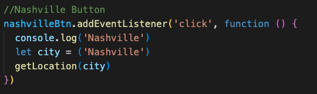
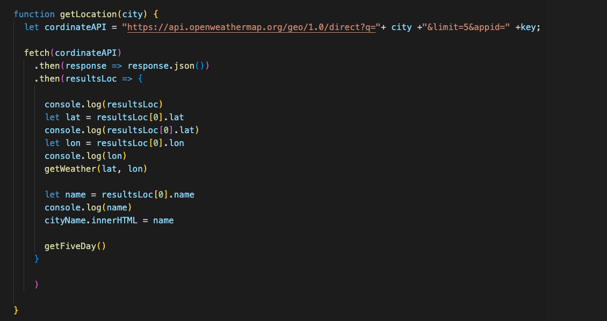
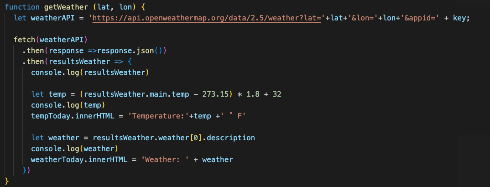
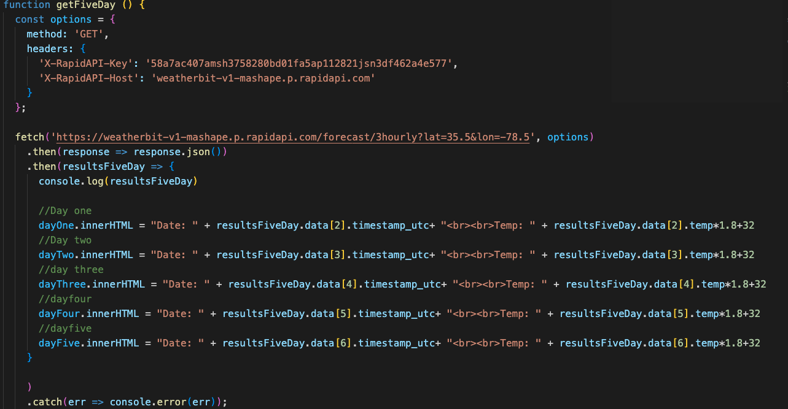

## Table of Contents
* [Title](*Title)
* [Introduction](*Introduction)
* [Technologies](*Technologies)
* [Set-up](*Set-up)
* [What-was-accomplished](*What-was-accomplished)
# Weather App
## Introduction

This project is a weather app whcih displays the weather for the current moment and the next five days

## Techonologiesasdfasdfa
Project is created with:
*HTML5
*CSS6
*JavaScript
*[Open Weather](https://openweathermap.org/)
*[Weather.io]( https://www.weatherbit.io/api)
## Set-up
To run, you can either clone the repo and run or go to via browser [https://grant-ellington.github.io/WeatherApp/](https://grant-ellington.github.io/WeatherApp/)
## What was accomplished
* Used bootstrap for a reponsive HTML design
* A searchable function which will pull the current weather from an API and display it on the page
* quick buttons which perform the same search functions.
* a self populating area that will update with the api per day and login.

###Functions created

#### Event listners

The below listeners listen and set up the variable city which will be used in the getLoacation function.

#### get Location function

The getlocatioin button uses an API to search through a list of cities, countries and states to retrieve relavant location GPS coordinates so that when searched they can pull up the relevant weather data for get weather

#### getWeather function

The getWeather function request data from the open weather API and dipsllays some key information within the dom elements apprpriate for it.

#### getFiveDay
I was unable to get the Openweather api for 5 day forecast or any forecast to work, so I found an (API weather io) with relevant data for proof of concept. I tried using the same lat and lon data, but they did not match the Open weathers coordinates, thus I lft it an a pre determined location. It works similiar to the getWeather function. 

